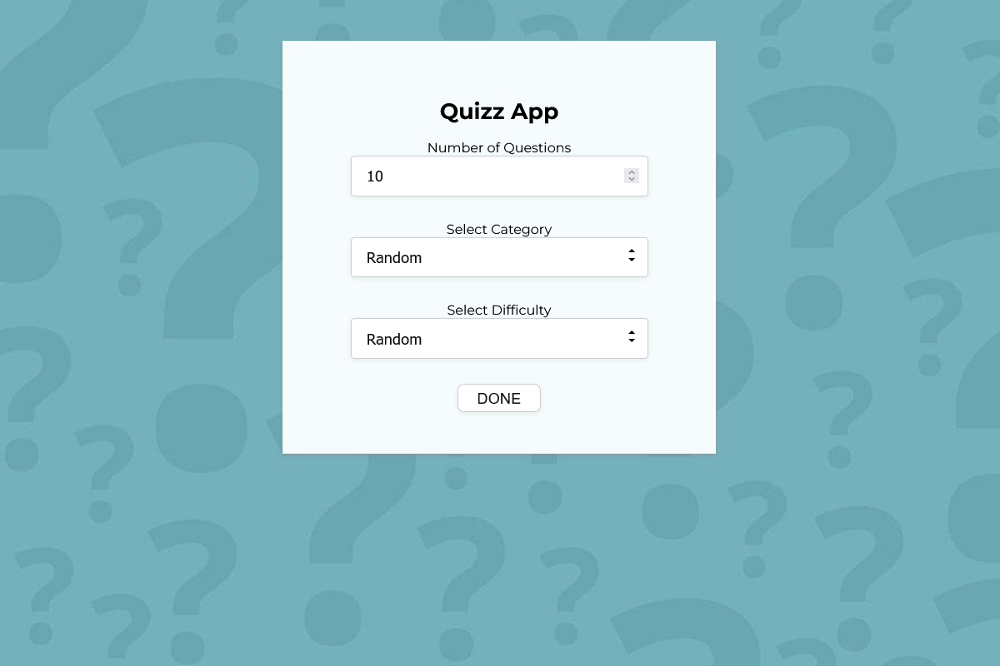
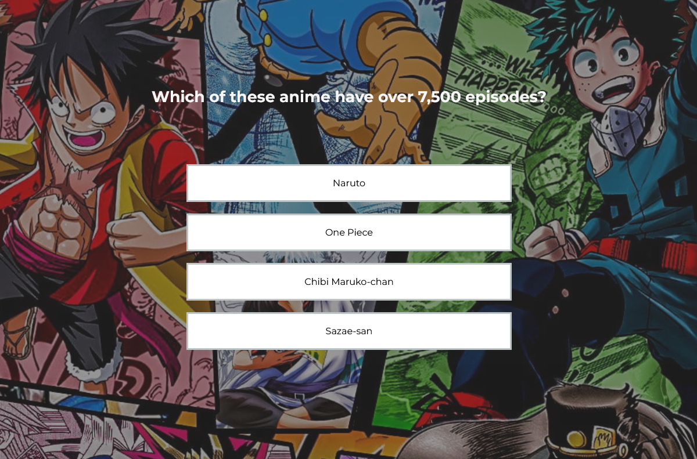

# Quizz App

<a href="https://divano-quiz-app.netlify.app/">
QUIZ LINK
</a>

 
This is a quizz app I've done for practice. Api used: <a href="https://opentdb.com">opentdb.com</a> 
Languages used in making of the app:

 

- HTML
- CSS
- JavaScript
- React

## App features:

- 12 categories and 3 difficulties for quiz questions
- max 50 questions for every category per difficulty
- green coloured border for right answer and red for wrong
- modal popup for final result

## Screenshots

